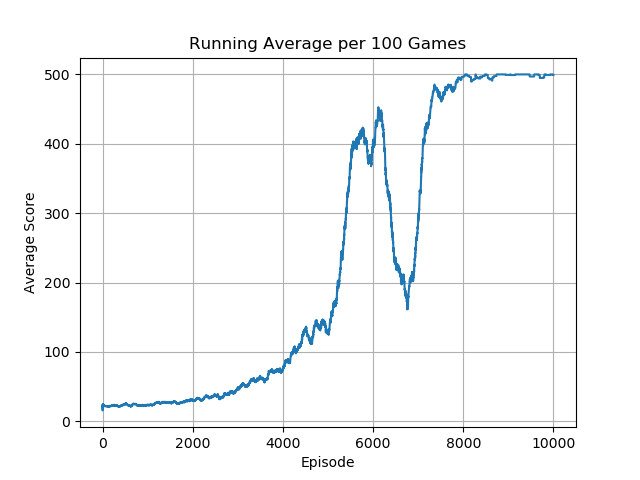
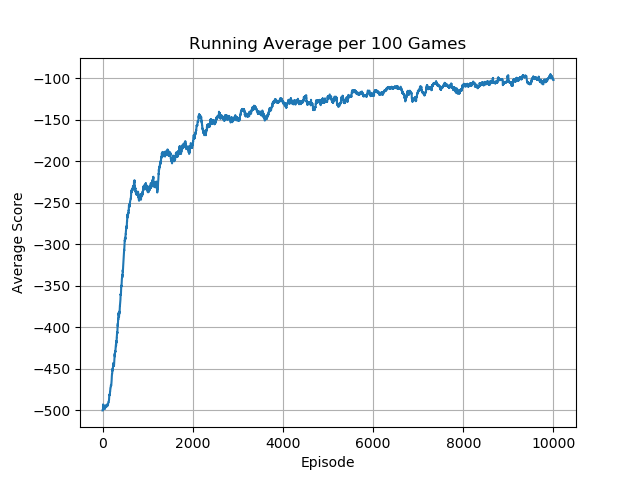
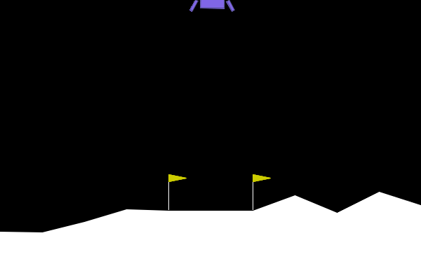
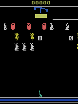
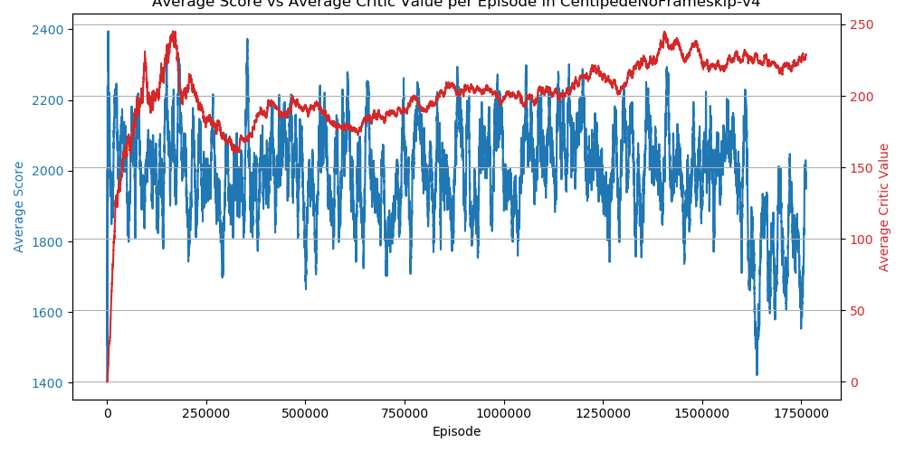

# Proximal Policy Optimization (Discrete)

## Overview

🚧 🛠️👷‍♀️ 🛑 Under construction...

This repository contains an implementation of Proximal Policy Optimization (PPO) for discrete action spaces, which has been evaluated against a variety of Gymnasium and Atari environments.  

The main script in its current form is configured for Atari environments, with a custom environment wrapper that follows the approach outlined in the original DQN paper (for this reason, it is recommended to use the 'NoFrameskip' versions of the environments).  

## Setup

### Required Dependencies

Install the required dependencies using the following command:

```bash
pip install -r requirements.txt
```

### Running the Algorithm

You can run the algorithm on any supported Gymnasium environment. For example:

```bash
python main.py --env 'MsPacmanNoFrameskip-v4'
```

## Results
#### 🤔 For your consideration: 
The Atari environments were trained for 20000 games. I regret this decision as it lead to inconsistent numbers of learning steps between environments (due to some games requiring more/less steps per game).  

I also did not use reward scaling, which I use for most other algorithms. This was a nearly arbitrary decision that came about due to initial debugging - at a certain point things suddenly began to work so I just kinda rolled with it...

I only started tracking the average critic value for a set of fixed states after many environments had already been trained, but I feel that this provides an additional interesting piece of context. 

<table>
    <tr>
        <td>
            <p><b>CartPole-v1</b></p>
            
        </td>
        <td>
            <p><b>MountainCar-v0</b></p>
            
        </td>
        <td>
            <p><b>Acrobot-v1</b></p>
            
        </td>
    </tr>
    <tr>
        <td>
            
        </td>
        <td>
            
        </td>
        <td>
            
        </td>
    </tr>
</table>
<table>
    <tr>
        <td>
            <p><b>LunarLander-v2</b></p>
            
        </td>
        <td>
            <p><b>AirRaid</b></p>
            
        </td>
        <td>
            <p><b>Alien</b></p>
            
        </td>
    </tr>
    <tr>
        <td>
            
        </td>
        <td>
            
        </td>
        <td>
            
        </td>
    </tr>
</table>
<table>
    <tr>
        <td>
            <p><b>Amidar</b></p>
            
        </td>
        <td>
            <p><b>Assault</b></p>
            
        </td>
        <td>
            <p><b>Asterix</b></p>
            
        </td>
    </tr>
    <tr>
        <td>
            
        </td>
        <td>
            
        </td>
        <td>
            
        </td>
    </tr>
</table>
<table>
    <tr>
        <td>
            <p><b>Asteroids</b></p>
            
        </td>
        <td>
            <p><b>Atlantis</b></p>
            
        </td>
        <td>
            <p><b>BankHeist</b></p>
            
        </td>
    </tr>
    <tr>
    <td>
            
        </td>
        <td>
            
        </td>
        <td>
            
        </td>
    </tr>
</table>
<table>
    <tr>
        <td>
            <p><b>BattleZone</b></p>
            
        </td>
        <td>
            <p><b>BeamRider</b></p>
            
        </td>
        <td>
            <p><b>Breakout</b></p>
            
        </td>
    </tr>
    <tr>
        <td>
            
        </td>
        <td>
            
        </td>
        <td>
            
        </td>
    </tr>
</table> 
<table>
    <tr>
        <td>
            <p><b>Krull</b></p>
            
        </td>
        <td>
            <p><b>Berzerk</b></p>
            
        </td>
        <td>
            <p><b>CrazyClimber</b></p>
            
        </td>
    </tr>
    <tr>
        <td>
            
        </td>
        <td>
            
        </td>
        <td>
            
        </td>
    </tr>
</table>
<table>
    <tr>
        <td>
            <p><b>DemonAttack</b></p>
            
        </td>
        <td>
            <p><b>Kangaroo</b></p>
            
        </td>
        <td>
            <p><b>KungFuMaster</b></p>
            
        </td>
    </tr>
    <tr>
        <td>
            
        </td>
        <td>
            
        </td>
        <td>
            
        </td>
    </tr>
</table>
<table>
    <tr>
        <td>
            <p><b>Zaxxon</b></p>
            
        </td>
        <td>
            <p><b>Skiing</b></p>
            
        </td>
        <td>
            <p><b>MontezumaRevenge</b></p>
            
        </td>
    </tr>
    <tr>
        <td>
            
        </td>
        <td>
            
        </td>
        <td>
            
        </td>
    </tr>
</table>
<table>
    <tr>
        <td>
            <p><b>Bowling</b></p>
            
        </td>
        <td>
            <p><b>Boxing</b></p>
            
        </td>
        <td>
            <p><b>Carnival</b></p>
            
        </td>
    </tr>
    <tr>
        <td>
            
        </td>
        <td>
            
        </td>
        <td>
            
        </td>
    </tr>
</table>
<table>
    <tr>
        <td>
            <p><b>Centipede</b></p>
            
        </td>
        <td>
            <p><b>ChopperCommand</b></p>
            
        </td>
        <td>
            <p><b>Defender</b></p>
            
        </td>
    </tr>
    <tr>
        <td>
            
        </td>
        <td>
            
        </td>
        <td>
            
        </td>
    </tr>
</table>
<table>
    <tr>
        <td>
            <p><b>DoubleDunk</b></p>
            
        </td>
        <td>
            <p><b>NameThisGame</b></p>
            
        </td>
        <td>
            <p><b>Solaris</b></p>
            
        </td>
    </tr>
    <tr>
        <td>
            
        </td>
        <td>
            
        </td>
        <td>
            
        </td>
    </tr>
</table>


## Acknowledgements

Special thanks to Phil Tabor, an excellent teacher! I highly recommend his [Youtube channel](https://www.youtube.com/machinelearningwithphil).
