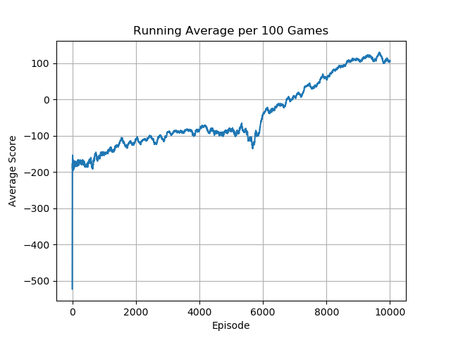

# Proximal Policy Optimization (Discrete)

## Overview

🚧 🛠️👷‍♀️ 🛑 Under construction...

Poor learning on lots of environments even when using the NoFrameskip envs...  
Reading lots of commentary on how the authors used a bunch of tricks they didn't include in the paper. I might have to do some fancier stuff to ensure the models learn effectively 🧐

## Setup

### Required Dependencies

Install the required dependencies using the following command:

```bash
pip install -r requirements.txt
```

### Running the Algorithm

You can run the algorithm on any supported Gymnasium environment. For example:

```bash
python main.py --env 'LunarLander-v2'
```

---

<table>
    <tr>
        <td>
            <p><b>CartPole-v1</b></p>
            
        </td>
        <td>
            <p><b>MountainCar-v0</b></p>
            
        </td>
        <td>
            <p><b>Acrobot-v1</b></p>
            
        </td>
    </tr>
    <tr>
        <td>
            
        </td>
        <td>
            
        </td>
        <td>
            
        </td>
    </tr>
</table>
<table>
    <tr>
        <td>
            <p><b>LunarLander-v2</b></p>
            
        </td>
        <td>
            <p><b>AirRaid</b></p>
            
        </td>
        <td>
            <p><b>Alien</b></p>
            
        </td>
    </tr>
    <tr>
        <td>
            
        </td>
        <td>
            
        </td>
        <td>
            
        </td>
    </tr>
</table>
<table>
    <tr>
        <td>
            <p><b>Amidar</b></p>
            
        </td>
        <td>
            <p><b>Assault</b></p>
            
        </td>
        <td>
            <p><b>Asterix</b></p>
            
        </td>
    </tr>
    <tr>
        <td>
            
        </td>
        <td>
            
        </td>
        <td>
            
        </td>
    </tr>
</table>
<table>
    <tr>
        <td>
            <p><b>Asteroids</b></p>
            
        </td>
        <td>
            <p><b>Atlantis</b></p>
            
        </td>
        <td>
            <p><b>BankHeist</b></p>
            
        </td>
    </tr>
    <tr>
    <td>
            
        </td>
        <td>
            
        </td>
        <td>
            
        </td>
    </tr>
</table>
<table>
    <tr>
        <td>
            <p><b>BattleZone</b></p>
            
        </td>
        <td>
            <p><b>BeamRider</b></p>
            
        </td>
        <td>
            <p><b>Breakout</b></p>
            
        </td>
    </tr>
    <tr>
        <td>
            
        </td>
        <td>
            
        </td>
        <td>
            
        </td>
    </tr>
</table> 
<table>
    <tr>
        <td>
            <p><b>Krull</b></p>
            
        </td>
        <td>
            <p><b>Berzerk</b></p>
            
        </td>
        <!--<td>
            <p><b>Breakout</b></p>
            
        </td>-->
    </tr>
    <tr>
        <td>
            
        </td>
        <td>
            
        </td>
        <!--<td>
            
        </td>-->
    </tr>
</table>

---

## Acknowledgements

Special thanks to Phil Tabor, an excellent teacher! I highly recommend his [Youtube channel](https://www.youtube.com/machinelearningwithphil).
